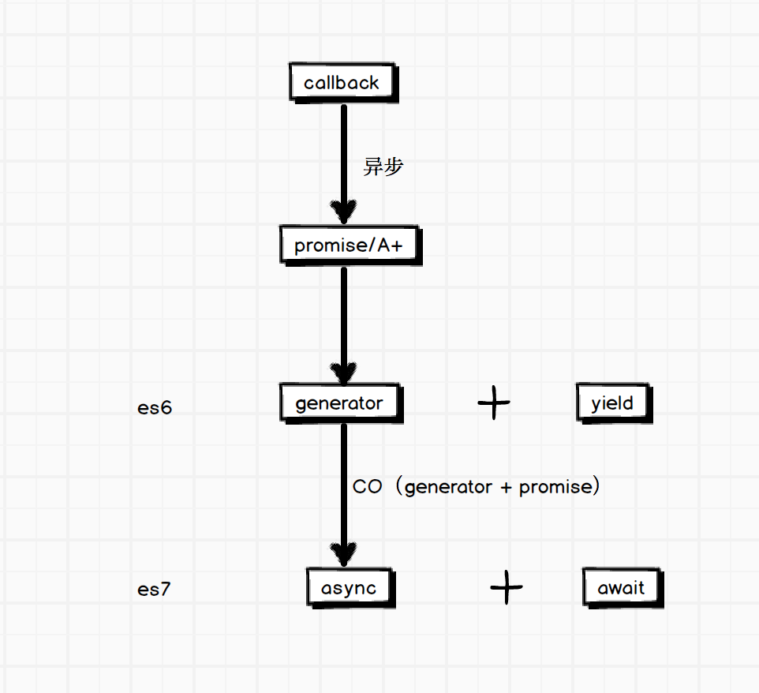

# koa-generator-examples


# koa基础

http://koa.bootcss.com/

## 上下文

koa的中间件

```
app.use(function *(next){
  this; // is the Context
  this.request; // is a koa Request
  this.response; // is a koa Response
});
```

说明：

- this是上下文
- *代表es6里的generator

http模型里的请求和响应

- this.request
- this.response


对比express的中间件

```
app.use(function (req, res, next) {
  return next();
});
```

express里的req和res是显式声明，看起来更清晰一些

next处理是一样的，二者无差异

# koa-generator

##安装koa-generator

```
npm install -g koa-generator
```

## 创建项目

```
koa helloworld
```

## 切换视图

视图默认使用的是jade。如果想使用其他的视图

```
koa 1.x/views-ejs -e
```

说明

- `-e, --ejs           add ejs engine support (defaults to jade)`

koa-generator使用的是[koa-views](https://github.com/queckezz/koa-views)，支持[所有consolidate.js支持模板引擎](https://github.com/tj/consolidate.js#supported-template-engines)


# HTTP
## Get

```
npm run 1
```


### 如何获取query参数

routes/index.js

```
var router = require('koa-router')();

router.get('/', function *(next) {
  console.log(this.request.query)
  console.log(this.query)
  
  yield this.render('index', {
    title: 'Hello World Koa!'
  });
});

module.exports = router;
```

访问http://127.0.0.1:3000/?a=1

日志

```
  <-- GET /?a=1
{ a: '1' }
{ a: '1' }
```

和express里获取query的方法是一样的，req.query

koa里是

- this.request.query
- this.query

这里需要说明以下this上下文上有request和response2个对象，每次写起来又比较麻烦

于是把request和response上的方法也丢给this，这样就相当于this上有了对应request和response里的方法的别名（简写方式）

- 别名列表

Request aliases

以下访问器和别名与 Request 等价：

- ctx.header
- ctx.method
- ctx.method=
- ctx.url
- ctx.url=
- ctx.originalUrl
- ctx.path
- ctx.path=
- ctx.query
- ctx.query=
- ctx.querystring
- ctx.querystring=
- ctx.host
- ctx.hostname
- ctx.fresh
- ctx.stale
- ctx.socket
- ctx.protocol
- ctx.secure
- ctx.ip
- ctx.ips
- ctx.subdomains
- ctx.is()
- ctx.accepts()
- ctx.acceptsEncodings()
- ctx.acceptsCharsets()
- ctx.acceptsLanguages()
- ctx.get()

Response aliases

以下访问器和别名与 Response 等价：

- ctx.body
- ctx.body=
- ctx.status
- ctx.status=
- ctx.length=
- ctx.length
- ctx.type=
- ctx.type
- ctx.headerSent
- ctx.redirect()
- ctx.attachment()
- ctx.set()
- ctx.remove()
- ctx.lastModified=
- ctx.etag=

### 如何获取params

express里经典用法

http://expressjs.com/en/4x/api.html#app.param


```
app.get('/user/:id', function (req, res, next) {
  console.log('although this matches');
  next();
});
```

请求是


访问http://127.0.0.1:3000/users/alfred


那么koa里如何使用呢？

关于路由

- express是自带路由
- koa这货没有，所以，需要另外集成，koa-generator使用的是目前比较流行的koa-router（我喜欢它的是Express-style）

https://github.com/alexmingoia/koa-router

好吧

routes/users.js

```
var router = require('koa-router')();

router.get('/:id', function *(next) {
  console.log(this.params);
  console.log(this.request.params);
  this.body = 'this a users response!';
});

module.exports = router;
```

执行

```
npm run 2
```

访问http://127.0.0.1:3000/users/alfred

日志

```
  <-- GET /users/alfred
{ id: 'alfred' }
undefined
GET /users/alfred - 28
```

首先肯定一点，this.params是可以取到params的，这点和express路由用法类似

但是注意的是

```
this.request.params != this.params
```

这说明params不是request上的方法，翻查源码，确实是如此

https://github.com/alexmingoia/koa-router/blob/5.x/lib/router.js#L317

## Post


## 上传


# 流程控制



http://www.ruanyifeng.com/blog/2015/05/async.html

## generator/co

### es6的generator是什么？

generator指的是

```
function* xxx(){
} 
```
是es6里的写法。

```
function* test() {
    console.log('1');
    yield 1;
    console.log('2');
    yield 2;
    console.log('3');
}
```


代码中间插了两行yield，代表什么呢？

- 当test执行到 yield 1这一行的时候，程序将被挂起，要等待执行下一步的指令；
- 当接收到指令后，test将继续往下运行，直到yield 2这一行，然后程序又被挂起并等待指令；
- 收到指令后，test又将继续运行，而下面已经没有yield了，那么函数运行结束。

这是不是就像，我们调试代码的时候，给插的断点 ？

当然，断点这个比喻，只是表象上比较相像，实质原理还是有非常大差异。


yield就是让后面的generator执行完成后，才继续往下走。


要注意，function后面多了一个星号，这样是表明这个函数将变成一个生成器函数，而不是一个普通函数了。意思就是，test这个函数，将不能被这样执行

test();
但可以获得一个生成器

var gen = test();  // gen就是一个生成器了
然后，生成器可以通过next()来执行运行

gen.next();

也就是上面说的，让函数继续运行的指令。

简单地总结一下：

- 生成器通过yield设置了一些类似”断点“的东西，使得函数执行到yield的时候会被阻断；
- 生成器要通过next()指令一步一步地往下执行（两个yield之间为一步）；
- yield 语句后面带着的表达式或函数，将在阻断之前执行完毕；
- yield 语句下面的代码，将不可能在阻断之前被执行；

由此可以看出，yield是如何将异步非阻塞代码，变成 异步阻塞代码。

### co


## async/await

## promise with bluebird

