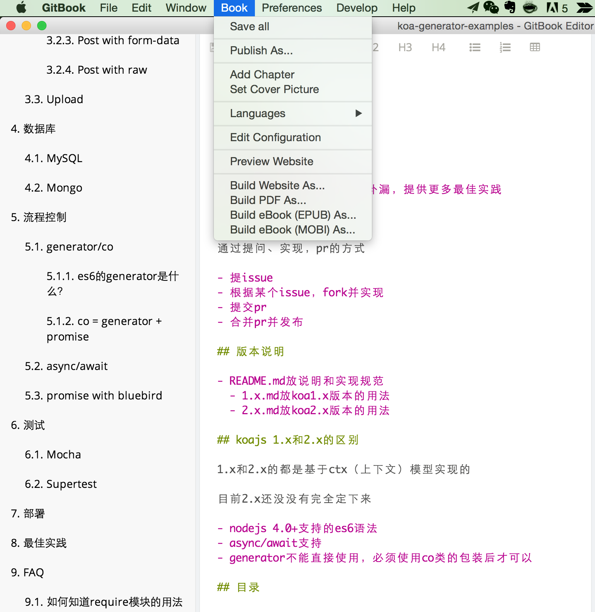

# gitbook发布说明

本书以gitbook为编辑器，发布到git pages上，为了便于大家使用，请按照如下办法生成并发布。

## 下载gitbook编辑器

https://www.gitbook.com/editor

## 生成html

> gitbook -> Book -> Preview Website



## 发布到git pages上

```shell
gulp deploy
```

## 预览并确认

访问 http://base-n.github.io/koa-generator-examples/
