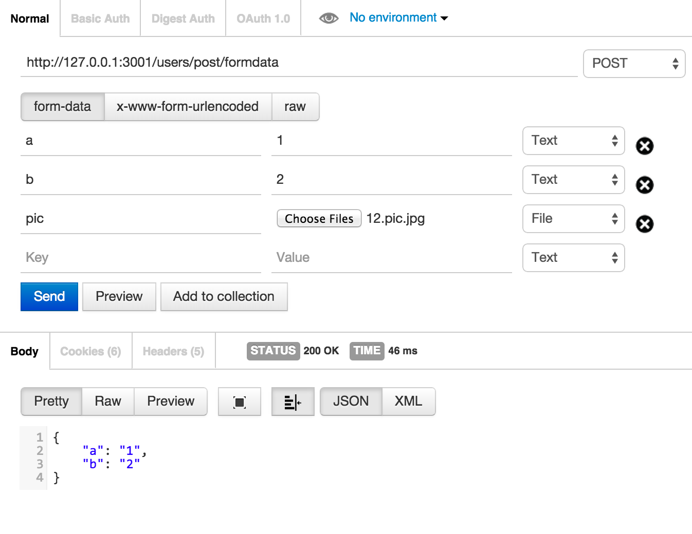

# 文件上传 Post with form-data

主要目的是为了上传

koa-v1 要是用 koa-multer-v0.0.2 对应的 multer < 1，所以本处需要指定版本安装

```shell
$ npm install --save koa-multer@0.0.2
```

Usage

```javascript
var app = require('koa')()
  , koa = require('koa-router')()
  , logger = require('koa-logger')
  , json = require('koa-json')
  , views = require('koa-views')
  , onerror = require('koa-onerror');


var multer = require('koa-multer');

app.use(multer({ dest: './uploads/'}));
```

You can access the fields and files in the request object:

```javascript
router.post('/post/formdata', function *(next) {
  console.dir(this.req.body)
  console.dir(this.req.files)

  this.body = 'this a users response!';
});
```

重要提示： Multer will not process any form which is not multipart/form-data

[see more](https://github.com/koa-modules/multer)


测试

```shell
$ npm test
```

使用Postman测试


