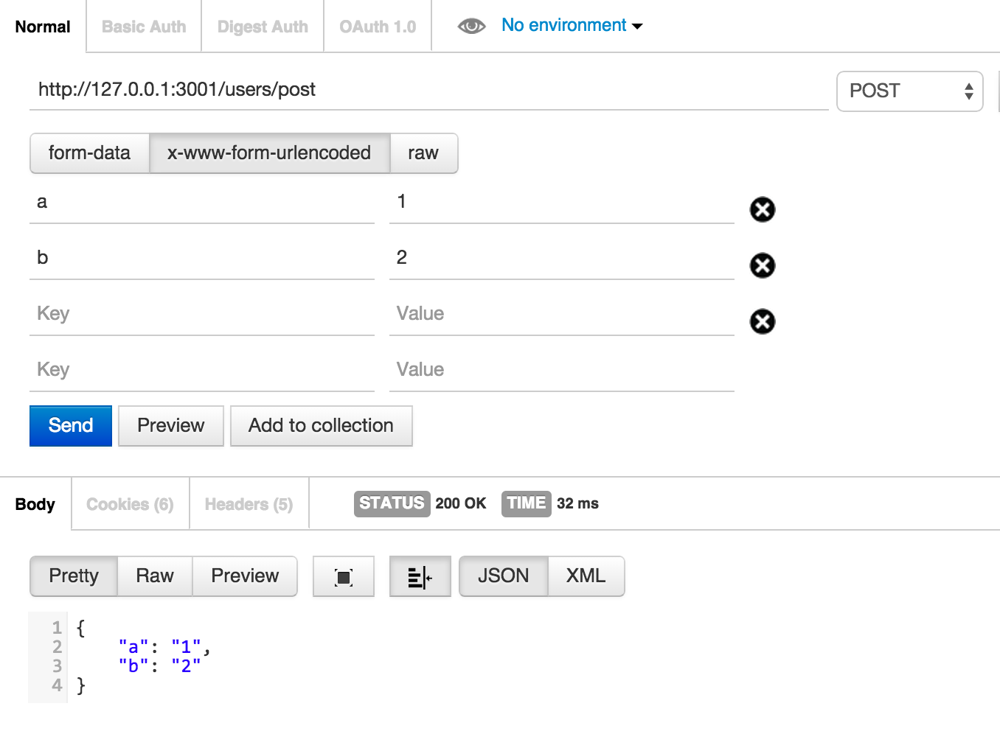

# 标准表单 Post with x-www-form-urlencoded

see `public/post.html`


```
<script>
$(function(){
	$.ajaxSetup({
	  contentType: "application/x-www-form-urlencoded; charset=utf-8"
	});

	$.post("/users/post", { name: "i5a6", time: "2pm" },
	   function(data){
	     console.log(data);
	   }, "json");

});
</script>
```

in `routes/users.js`

```
router.post('/post', function(req, res) {
  // res.send('respond with a resource');
	res.json(req.body);
});
```

测试

```shell
$ npm test
```

使用Postman测试



