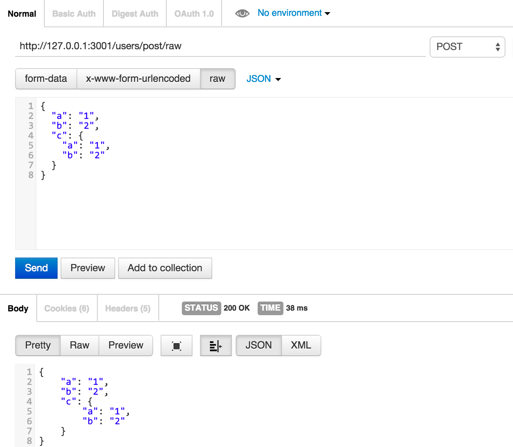

# Post with raw(todo)

To get the raw body content of a request with Content-Type: "text/plain" into req.rawBody you can do:

https://gist.github.com/tj/3750227


req.rawBody已经被干掉了，现在只能用req.text

下面是tj给出的代码片段

```javascript
var express = require('./')
var app = express();

app.use(function(req, res, next){
  if (req.is('text/*')) {
    req.text = '';
    req.setEncoding('utf8');
    req.on('data', function(chunk){ req.text += chunk });
    req.on('end', next);
  } else {
    next();
  }
});

app.post('/', function(req, res){
  res.send('got "' + req.text + '"');
});

app.listen(3000)
```


测试

```shell
$ npm test
```

使用Postman测试


