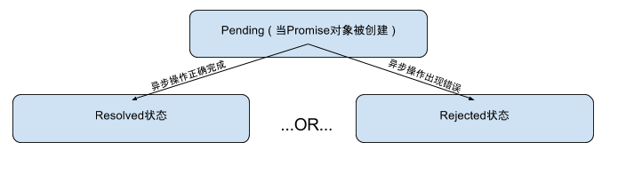

## Promise的历史  

在Promise出现之前，如果大家需要实现异步操作，通用的做法是事件加上回调函数，如果我们有多个异步操作需要嵌套执行的话，那么代码将变得非常难于阅读。让我们来看一个具体的代码例子。在下面的例子中，我们首先通过Http request调用一个web service，然后将从web service收到的数据写入一个本地文件。从任务的角度来看，这是一个非常简单的任务，但是当你第一次看到这个代码的时候，一定觉得头很晕，因为在这段代码中

* 对web service进行调用的代码和写文件的代码混杂在一起（写文件的代码嵌套在`end`事件的回调函数中），造成代码模块不清晰，阅读和理解起来比较费劲。
* 对错误的处理分散在代码的各个地方，而且错误处理的实现方式都不一样。对web service进行调用的代码，通过监听`error`事件来处理错误，并且将错误输出到控制套；而写文件的代码，是通过回调函数来处理错误，并将错误通过`throw`语句抛出。

```javascript
var http = require("http");
var fs = require("fs");
var querystring = require("querystring");
var postData = querystring.stringify({
  'msg' : 'Hello World!'
});

var options = {
  hostname: '127.0.0.1',
  port: 8080,
  path: '/upload',
  method: 'POST',
  headers: {
    'Content-Type': 'application/x-www-form-urlencoded',
    'Content-Length': postData.length
  }
};

var req = http.request(options, (res) => {
  console.log(`STATUS: ${res.statusCode}`);
  console.log(`HEADERS: ${JSON.stringify(res.headers)}`);
  res.setEncoding('utf8');
  
  var dataReceived = ""
  
  res.on('data', (chunk) => {
	dataReceived = dataReceived + chunk.toString();
    console.log(`BODY: ${chunk}`);
  });
  
  res.on('end', () => {
    console.log('No more data in response.')
	//now we try to write the message to a file
	fs.writeFile("temp.txt", dataReceived, function(err){
		if (err){
			throw err;
		}
		console.log("Write file temp.txt succ");
	});
  })
});

req.on('error', (e) => {
  console.log(`problem with request: ${e.message}`);
});

// write data to request body
req.write(postData);
req.end();
```

接下来，让我们使用Promise重写上面的代码。在重写的代码中，我们可以看到：

* 对web service进行调用的代码和写文件的代码完全分离开了，代码结构变得非常清晰。在阅读代码的过程中，不会再被不相关的代码所干扰。
* Promise对象对外提供了统一的回调函数接口（resolve和reject回调函数 ），在重写的代码中，我们可以很容易的把对web service的请求分装到一个模块中，从而对外隐藏Http Request的所有细节。
* 通过Promise对象的封装，对错误代码的处理被统一了，都是通过对`reject`函数调用来说明异步操作过程中有错误发生，而且错误被集中到`.catch`代码段进行了处理（错误都被输出到了控制台）。
* 通过Promise的封装，异步操作的代码变得和同步操作代码很像，更方便其他人理解代码的处理逻辑。

```javascript
'use strict';
var http = require("http");
var fs = require("fs");
var querystring = require("querystring");
var postData = querystring.stringify({
  'msg' : 'Hello World!'
});

var options = {
  hostname: '127.0.0.1',
  port: 8080,
  path: '/upload',
  method: 'POST',
  headers: {
    'Content-Type': 'application/x-www-form-urlencoded',
    'Content-Length': postData.length
  }
};

var pHttpRequest = new Promise(function(resolve, reject){
	let req = http.request(options, (res) => {
	  console.log(`STATUS: ${res.statusCode}`);
	  console.log(`HEADERS: ${JSON.stringify(res.headers)}`);
	  res.setEncoding('utf8');
	  
	  let dataReceived = ""
	  
	  res.on('data', (chunk) => {
		dataReceived = dataReceived + chunk.toString();
	  });
	  
	  res.on('end', () => {
		resolve(dataReceived);
	  })
	});
	
	req.on('error', function(e){
		reject(e);
	});
	
	req.write(postData);
	req.end();	
})

pHttpRequest.then(
    //http request promise成功时候的处理
    //在http request promise成功的时候，开始处理写文件操作
	function(dataReceived){
		return new Promise(function(resolve, reject){
			fs.writeFile("temp.txt", dataReceived, function(e){
				if (e) reject(e);
				else resolve("Write file succ");
			});
		})
	}
).then(
    //writeFile promise成功时候的处理
	function(msg){
		console.log(msg);
	}
).catch(
    //全局错误处理
	function(err){
	   console.log("some error happen(" + err + ")");
	}
)
```

正式基于Promise对象有上面所说的这些优点，ES6正式将Promise对象编程了系统的一个内置对象，大家再也不用通过第三方库开始用Promise对象了。

## Promise对象的特性 

* Promise对象一旦创建，就开始执行了，你没有办法取消Promise对象的执行。
* Promise对象的状态只由异步操作的结果决定，没有任何其他的操作可以改变Promise对象的状态如果异步操作执行成功，Promise对象将进入Resolved状态，同时resolve函数将被调用；如果异步操作执行失败，Promise对象将进入Rejected状态，同时reject函数将被调用。
* Promise对象一旦进入Resolved或者Rejected状态，状态将不可能再发生变化，在Promise对象被销毁之前，将一直保持Resolved或者Rejected状态。
* 因为Promise对象的实现方法，在异步操作过程中出现的异常是不会被抛出的，因此需要在Promise对象内部进行处理（通过提供`.catch`代码段来实现）。
 
下图表示了一个Promise对象的整个生命周期。



## Promise对象的使用  

创建Promise对象  
--------------------------------------------------------------------------------

在ES6中，你可以通过```new Promise(function(resolve, reject){
})```来创建Promise对象，下面是一个具体的代码。

```javascript
'use strict';
var fs = require("fs");
var promiseObj = new Promise(function(resolve, reject){
    //put some code to call
    fs.readFile("temp.txt", (err, data) => {
        if (err){
            reject(err);
        }else{
            resolved(data);
        }
    });
});
```

关联resolve function和reject function 
--------------------------------------------------------------------------------

在上面的例子中，如果你执行这个代码，你会发现没有任何的效果（没有输出），那是因为你没有给这个创建的Promise对象关联相应的resolve和reject函数。下面是一个进一步的例子，这个例子将给Promise对象绑定resolve和reject函数，你就可以看到效果了。在我的测试环境中，因为我们有名为"temp.txt"的文件存在，所以输出了```file read fail```。

```javascript
'use strict';
var fs = require("fs");
var promiseObj = new Promise(function(resolve, reject){
    //put some code to call
    fs.readFile("temp.txt", (err, data) => {
        if (err){
            reject(err);
        }else{
            resolved(data);
        }
    });
});
promiseObj.then(function(data){
    console.log("file read succ");
}, function(err){
    console.log("file read fail");
})
```

在通常情况下，reject状态的函数我们一般不在then中设置，而是在catch中设置，这样代码看起来更像是传统意义上的同步代码(和try...catch比较）。因此上面的例子可以重新写成 

```javascript
'use strict';
var fs = require("fs");
var promiseObj = new Promise(function(resolve, reject){
    //put some code to call
    fs.readFile("temp.txt", (err, data) => {
        if (err){
            reject(err);
        }else{
            resolved(data);
        }
    });
});
promiseObj.then(function(data){
    console.log("file read succ");
}).catch(function(err){
    console.log("file read fail");
});
```

级联多个Promise对象
--------------------------------------------------------------------------------

Promise对象的resolve函数的参数可以是另外一个Promise对象，这样就可以将2个Promise对象级联起来。下面是一个简单的例子

```javascript
'use strict';
var p1 = new Promise(function(resolve, reject){
    setTimeout(() => reject(new Error("something test"), 3000));
});

var p2 = new Promise(function(resolve, reject){
    setTimeout(() => resolve(p1), 1000);
});

p2.then(function(data){
   console.log("p2 succ");
}).catch(function(err){
   console.log("p2 fail");
});
```

## Promise的特殊函数  

Promise.all()
--------------------------------------------------------------------------------

将多个Promise包装成一个全新的Promise Object，如果所有的Promise被Resolved，那么新的Promise将被Resolve；否则新的Promise将被Reject。

Promise.race()
--------------------------------------------------------------------------------

和.all一样，.race将把多个Promise包装成一个新的Promise Object，不同的地方是。这些Promise之中任何一个Resolve或者Reject了，新的Promise就被Resolve或者Reject了。

Promise.resolve()
--------------------------------------------------------------------------------

将传入的对象封装成一个Promise对象返回。resolve方法根据以下的规则返回Promise对象。

* 如果输入的参数本身是一个Promise对象，那么resolve方法直接返回这个对象；
* 如果输入的对象本身有then方法（必须是一个可以接受2个function的方法），那么resolve将这个对象转换成Promise对象，并理解调用then方法；下面是一个例子
 
```javascript
//for this example, you will see following output
//   then function in thenobject
//   Promise object resolve function is called Then function is called
var thenobject = {
    then: function(resolve, reject){
       console.log("then function in thenobject");
       resolve("Then function is called");
    }
};

var pObj = Promise.resolve(thenobject);
pObj.then(function(data){
    console.log("Promise object resolve function is called " + data);
});
```

* 如果传入的参数就是一个普通对象，那么返回的Promise对象直接处于resolved状态，并且输入的参数将作为resolved状态下调用的函数的参数。下面是一个具体的例子。

```javascript
//for this example, you will see following output
//   Promise object resolve function is called Hello World!
var pObj = Promise.resolve("Hello World!");
pObj.then(function(data){
    console.log("Promise object resolve function is called " + data);
});
```

*如果没有输入参数，那么返回的Promise对象直接处于resolved状态，并且resolved状态下调用的函数没有输入参数。

done() method
--------------------------------------------------------------------------------

通过在Promise的调用链最后使用这个方法，可以保证catch到任何的错误。

finally() method
--------------------------------------------------------------------------------

如果你需要在Promise结束的时候（不管resolve还是reject结束），都有一个函数被调用，那么就需要使用这个方法。这个方法接受一个回调函数作为输入。当Promise结束的时候，这个回调函数将被调用。